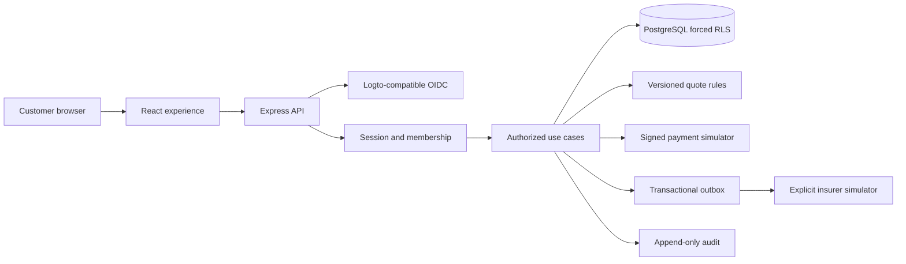

# Architecture and release boundary

## Delivered scope

Version 0.1 is a local multi-insurer demonstrator: browse 12 categories / 24 variants, compare up to three, calculate a deterministic quote, submit a consented application, retrieve a non-payable QR, follow a verified simulator payment and a separate insurer outcome, and retrieve a synthetic document. PostgreSQL persists business records across reloads and restarts. Categories are extensible; the sample catalogue does not claim to contain every real insurer product.

## Engineering delivery harness

The project-specific engineering-agent team, BADF integration, evidence lifecycle, memory/learning pipeline, and controlled delivery plan are specified in [BIZTRUST-ADF-ENG-001-v0.2](architecture/BIZTRUST-ADF-ENG-001-v0.2.md). The specification consumes BADF by pinned reference and does not copy its canonical policies or validators into the product repository.

## ADR 001 — modular monolith

React 19 + Vite 8 client, Express 5 + TypeScript API/BFF and PostgreSQL 17. The repository had no application stack. One origin serves both client and API; secrets stay on the server.

| Module               | Responsibility                                                       |
| -------------------- | -------------------------------------------------------------------- |
| `src/`               | Browse, filter, compare, forms, account, tracking, draft locale keys |
| `catalog.ts`         | Synthetic versioned terms and provenance, multi-insurer categories   |
| `domain.ts`          | Schemas, deterministic pricing, transitions and signing              |
| `auth.ts`            | OIDC, server sessions, membership and CSRF                           |
| `services.ts`        | Transactions, idempotency, snapshots and evidence                    |
| `db.ts` / migrations | Least-privilege role and transaction-local isolation                 |
| `app.ts`             | HTTP API, rate limits, request IDs and safe errors                   |

## ADR 002 — identity and isolation

The first staff backend slice now uses a separate confidential OIDC client, `/ops` cookie, pre-provisioned operations membership, and `/ops/v1` read-only APIs. Customer sessions cannot use staff routes; staff sessions cannot be replayed at customer routes. See `docs/operations.md` for routes and setup. The staff console UI, MFA/step-up and privileged actions remain pending owner policy and provider decisions.

No Logto implementation was found in the named reference source. `openid-client` provides a confidential OIDC web integration compatible with Logto. Configure an HTTPS issuer, client ID/secret and exact `/api/auth/callback` redirect. Code flow uses PKCE S256, state, nonce, issuer/audience/expiry checks and explicit JWS verification. Authorization attempts expire in ten minutes; login rotates the session.

Demo mode creates a browser-specific, unguessable customer identity, without a password/account system. It is restricted to loopback by startup validation. Sessions last twelve hours. Local logout revokes the application session, not the identity provider's entire session. OIDC membership is rechecked on every request for disabled accounts and changed roles.

Tenant and role come from server membership; public OIDC enrolment only creates customer membership in the configured tenant. Staff provisioning is outside runtime permissions. Browser tenant/owner/role fields are rejected by strict input schemas.

| Actor             | Allowed                                                   | Restriction                                                      |
| ----------------- | --------------------------------------------------------- | ---------------------------------------------------------------- |
| Anonymous         | Synthetic catalogue and session                           | No business records                                              |
| Customer          | Own quotes, applications, invoices, history and documents | Own tenant AND owner only                                        |
| Operations        | Assigned tenant's records and reconciliation readout      | No cross-tenant access, financial decision or real issuance API  |
| Verified callback | Exact invoice transition under signed context             | Signature, amount, currency, reference, expiry and replay checks |
| Migration owner   | Versioned schema changes                                  | Never used by running API                                        |

Agent, broker, insurer-operator, tenant-admin and platform-admin workflows need further permissions and business implementation. No broad default administrator is provided.

Six business tables force RLS. Context is transaction-local with guaranteed rollback/release; pooled-context leakage is tested. Runtime refuses superuser/BYPASSRLS credentials. Audit rows grant only INSERT/SELECT to runtime. Database administrators remain outside that guarantee; external audit anchoring is future production work.

## ADR 003 — synthetic integrations with explicit trust boundaries

All insurers, prices and outcomes are visibly synthetic. QR payloads begin `BIZTRUST-DEMO-NOT-PAYABLE` and cannot initiate a banking payment.

Payment callback verification uses HMAC-SHA256 of `timestamp + '.' + exact raw body`, a five-minute window, provider event IDs and invoice ownership/reference/amount/currency/expiry checks. Changed payload under the same event ID conflicts. Late or mismatched payments remain under reconciliation. Settlement writes an outbox item atomically; duplicates cannot create extra work or reverse settled status. The browser simulation uses server-only signing and the same domain handler.

Application creation locks the customer/key scope transactionally, validates owned unexpired quotes and current availability, and atomically stores product/consent snapshots, application, invoice and audit. Retries with the same key/payload return the same reference; changed input conflicts. One quote cannot create multiple applications.

Insurer simulation explicitly consumes queued work and records timeout/referral/information/rejection/issuance outcomes. There is no unattended external delivery worker or real provider call. Demo-issued evidence contains source, timestamp, reference and `noCoverage: true`. Downloaded documents state **NOT AN INSURANCE POLICY**.

| Record                | Lifecycle                                                                                                |
| --------------------- | -------------------------------------------------------------------------------------------------------- |
| Quote                 | Immutable, expires after 30 minutes                                                                      |
| Application           | Durable submitted record with preserved quote and consent                                                |
| Invoice               | Pending / failed / settled / reconciliation; expiry uses server clock                                    |
| Provider event        | Settled / failed / already settled / late review / mismatch review                                       |
| Insurer               | Awaiting payment → queued → processing, referral, additional information, timeout, rejection or issuance |
| Final insurer outcome | Issued and rejected cannot be overwritten; identical retries are idempotent                              |
| Outbox                | Pending / retry required / delivered with attempt count                                                  |

Real policy contracts, cancellations, endorsements, claims assistance, commissions, refunds, notifications and a settlement ledger are deferred until approved business/provider contracts exist.

## Threat controls and remaining work

| Risk                  | Implemented control                                             | Remaining evidence                                       |
| --------------------- | --------------------------------------------------------------- | -------------------------------------------------------- |
| Tenant escape         | Forced RLS, ownership/role/API negative tests                   | External assessment, support-access process              |
| Forged payment/replay | Signed exact bytes, timestamp, event IDs, reconciliation        | Per-provider keys, real provider acceptance and rotation |
| CSRF/session theft    | HttpOnly/SameSite cookies, exact origin + CSRF, Secure on HTTPS | TLS, Logto MFA and recovery tests                        |
| False policy status   | Separate insurer state, explicit synthetic evidence             | Authorized insurer/binding agreement                     |
| Injection             | Parameterized SQL, strict schemas, React escaping, CSP          | Review as adapters are added                             |
| Data leakage          | No client secrets, safe request-ID errors, no PII logging       | Retention, audit export, central telemetry               |
| Malicious uploads     | No upload endpoint                                              | Scanned private object storage and access checks         |
| Dependencies          | Lockfile, CI, npm audit                                         | Automated update review                                  |

## Production gate

`DEMO_MODE=false` intentionally fails startup. Production activation is an implementation/review milestone, not a toggle that publishes fixtures. APISIX is not configured; intended future topology is TLS/APISIX → same-origin web/API → private PostgreSQL, with an outbox worker and provider adapters. No deployment, DNS, tunnel, global routing or remote repository write is performed.

Business owners must supply real products/distribution authority, settlement/refund contracts, insurer interfaces, identity acceptance, reviewed translations/legal notices and retention. Infrastructure owners must supply hosting, secrets, telemetry, recovery targets and a restoration drill. See discovery.md for the decision register.

Suggested measurements, without invented targets: compare-to-application conversion, quote turnaround, verified-payment ratio, reconciliation backlog age and insurer response latency.

**Quote:** conditional, time-limited indication. **Submission:** request for insurer review. **Binding authority:** documented insurer delegation, absent here. **Coverage evidence:** authoritative insurer artifact, absent in the demo. **Policy:** insurer contract, never inferred from payment or QR.

Primary references: [openid-client](https://github.com/panva/openid-client), [PostgreSQL RLS](https://www.postgresql.org/docs/current/ddl-rowsecurity.html), [Vite](https://vite.dev/guide/).
