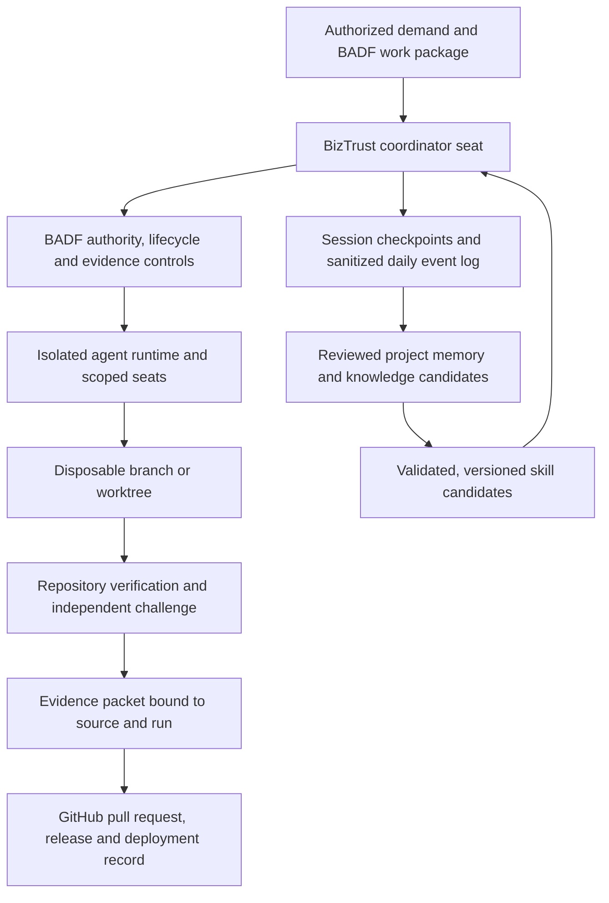
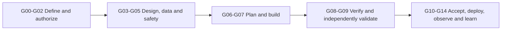
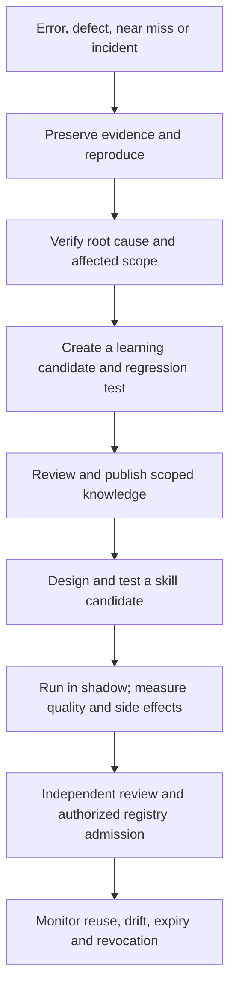

# BIZTRUST-ADF-ENG-001 — Engineering Agent Team and Full-Cycle Harness

## Document control

| Field | Value |
|---|---|
| Artifact | BIZTRUST-ADF-ENG-001 |
| Version | 0.2 |
| Status | Proposed design for governed implementation planning |
| Project repository | bstBizEra/biztrust_ib |
| Framework reference | bstBizEra/badf |
| Baseline reviewed | BizTrust main at 8c70ecbfe2d6c6e8bae968ed90928db7336b9a58; BADF main at c519ac43e061a5d76cd3850b36730935e3614b43 |
| Scope | Project engineering-agent team, execution harness, evidence, memory, learning, governed Supabase access and Codex tooling profile |
| Revision note | v0.2 adds Supabase credential boundaries and a source-pinned Codex tool/skill profile; it authorizes no runtime or external-system access |
| Authority | This design grants no agent, model, skill or automation authority |

## Executive proposal

Implement the BizTrust engineering-agent team as a **project instance governed by BADF**, rather than creating a second authority system or copying BADF's lifecycle engine into the product repository.

BADF remains the canonical control plane for demand, work-package authority, change classification, lifecycle gates, evidence validation, human-reserved decisions, and skill admission. The BizTrust ADF team is the bounded execution and learning plane: it plans admitted work, routes a small number of specialist seats, changes code only inside an authorized work package, runs the repository's existing verification command, records evidence, and proposes reusable learning.

The target is a complete, repeatable path from authorized demand to observed production outcome and assurance closure. Routine, reversible work may become highly automated after independent controls are proven. A green test run or an agent consensus never authorizes a production release, accepts legal or privacy risk, changes insurance terms, or grants access to real customer or financial data. Where policy reserves a decision for a human, the harness stops with a concise decision packet.

The Codex workstation profile in §13.2 records the owner-reported ECC 2.2.2 installation and the six selected third-party Git skills. These tools are execution aids, not BADF authority. Supabase is a candidate external service only; the profile does not connect to a project, select Supabase as BizTrust's runtime database, or authorize schema changes.

This document is a project-specific proposal. It does not initialize a BADF instance, create a work package, activate an agent runtime, change the existing application, or authorize production access. Those actions require their own admitted work and current authority.

## 1. Boundary and source of authority

| Concern | Canonical owner | BizTrust use |
|---|---|---|
| General-purpose lifecycle, gate definitions, schemas, authority matrix, validators, built-in skills | BADF repository | Consume by pinned framework revision; do not copy or fork these controls |
| BizTrust product requirements, application architecture, APIs, data, product decisions and customer outcomes | BizTrust repository and named business authorities | Keep product-specific contracts and decisions here |
| BizTrust team profile, specialist routing, local risk restrictions, permitted paths and verification commands | BADF project instance, after authorized initialization | Narrow the framework's permitted capability; never widen it |
| Agent reasoning and implementation | Replaceable, scoped execution seats | Produces proposals, code and evidence; never grants itself approval |
| Build/test result | CI and independent verification records | Evidence bound to source tree, toolchain and run identity |
| Runtime behavior | Production observability and incident system | Evidence for deployment, operations and learning |

Use these definitions consistently:

- **ADF team** is the BizTrust project engineering-team runtime and its operating workflow.
- **BADF** is the governance framework and deterministic authority/control plane.
- **AET** is BADF's Agentic Engineer Team runtime contract. The reviewed upstream contract describes AET-A as frozen and AET-B through AET-E as defined and gated, not implemented. Recheck the live contract and its prerequisites before assigning implementation work.
- A **seat** is a bounded operating role such as coordinator, builder, reviewer, verifier, release observer or librarian. A seat is not a legal identity or an independent approval merely because it has a different prompt.
- A **skill** is a versioned, tested procedure. A skill may improve execution; it cannot grant permission or change a gate.

General runtime substrate and generic policy belong in bstBizEra/badf. BizTrust-specific integration belongs in this repository only after an authorized project-instance work package identifies the interface and the pinned BADF revision. A generic change discovered while building BizTrust becomes a separate BADF demand; it must not be implemented as an undocumented local fork.

## 2. Repository baseline and design constraints

The design is anchored to the BizTrust main branch snapshot reviewed for this proposal:

| Observed baseline | Harness implication |
|---|---|
| The app is a local demonstration using React/Vite, Express/TypeScript and PostgreSQL. | Reuse the existing application and workflow; do not scaffold a replacement platform for agents. |
| The catalogue, premiums, QR instructions and insurer outcomes are synthetic. The README states that no real payment is taken and no coverage is provided. | Use synthetic fixtures and provider simulators in agent runs. Never describe a test result as payment, coverage or insurer approval. |
| The app exposes a verification command, npm run verify, covering lint, typecheck, tests, build, startup/browser checks and production-dependency audit. | Treat the command as the default full repository gate, with narrower tests allowed only as an early diagnostic. |
| GitHub Actions runs the verification workflow with Node 24 and PostgreSQL 17; a separate tag-triggered release workflow publishes a versioned demonstration image and GitHub release. | Keep verification deterministic; bind evidence to the workflow run, commit/tree, package lock and test database identity. Keep a release tag separate from release authority. |
| Identity uses a Logto-compatible OIDC integration through the application stack; the verification note says live Logto has not been validated. | Do not give an agent live identity credentials. Test OIDC behavior with controlled configuration or a simulator until an approved sandbox is available. |
| The reviewed 8c70ecb baseline had a read-only operations API. As of 26 September 2026, main at 47154e6 also has a read-only `/ops` console UI; privileged staff actions remain unimplemented. | Reuse the existing scoped console and services. Agent administration must not invent self-provisioning, refunds, publication actions or force-status behavior. |
| Live payment/insurer providers, production hosting, recovery and production approval remain launch dependencies. | No production deployment capability exists by implication. Production admission requires separate evidence and authority. |

The source snapshot and the current repository files are evidence for this proposal, not permanent facts. At each work package, the repository analyst must check the current main revision, project instructions, workflow, scripts, tests, application state and outstanding decisions. If the checkout differs from the snapshot, record the difference and use current source.

## 3. Outcomes, scope and non-goals

### Outcomes

The harness should:

1. Accept only work tied to a current, authorized BADF work package.
2. Translate the accepted outcome into a traceable plan, dependency graph, task ownership and verification strategy.
3. Route work to the minimum necessary agent seats and enable safe parallel implementation.
4. Contain every write to a disposable branch/worktree and declared path set.
5. Verify the composed change with the repository's actual command and independent review.
6. Produce a complete evidence packet for each gate and pull request.
7. Preserve a useful daily engineering log without copying raw conversations, secrets or customer records into memory.
8. Promote validated experience through explicit stages: error or incident, verified learning, reviewed knowledge, tested skill candidate, shadow evaluation, and governed admission.
9. Continue after interruption from Git state and sealed checkpoints, not from an agent's recollection.
10. Provide a controlled plan-to-production path that stops whenever authority, evidence, environment or partner readiness is missing.

### Non-goals

The harness is not an insurance decision engine; it cannot set premiums, decide eligibility, underwrite, bind coverage, confirm payment, issue policy evidence, accept legal wording or approve claims. It is not a customer-service bot, a production database console, a replacement for GitHub/CI, a memory-only source of truth, or a self-modifying governance system.

Do not introduce a new vector database, event bus, orchestration vendor, model provider or deployment platform before an architecture work package compares it with the existing repository and approved infrastructure. Start with versioned records, isolated runners and deterministic validation; add infrastructure only for a demonstrated need.

## 4. Harness topology

The control plane determines whether an action is allowed. The model runtime may recommend or perform an allowed action but cannot change the gate result. GitHub is the source of truth for source and review history; BADF is the source of truth for authority, lifecycle and evidence acceptance; CI is the source of truth for the build/test run; the production observability platform is the source of truth for runtime signals. A mirror or memory index must retain canonical record IDs, revision/digest, freshness and source.

## 5. Team seats and separation of duties

Keep six persistent seats. Invoke other specialists only when the work package, gate, risk or declared non-coverage requires them; do not start a large swarm for every issue.

| Seat | Responsibilities | Boundary |
|---|---|---|
| Coordinator | Frames work, checks authority, decomposes tasks, dispatches seats, reconciles results and assembles evidence. | Cannot approve its own work, change BADF policy or infer missing authority. |
| Builder controller | Assigns bounded implementation tasks to UI, API, data or integration builders and composes their changes. | Builder writes stay within declared paths, synthetic data and work-package permissions. |
| Independent reviewer | Challenges the declared artifact/tree across required lenses and records findings and non-coverage. | Must be independent from the authoring run wherever policy requires; “no findings” is not proof of correctness. |
| Verifier | Reproduces tests or runtime observations and records command, environment, source identity and result. | Must not author the change it verifies when independence is required. |
| Release/runtime observer | Packages release evidence and observes staging/production health within explicit access. | Observe by default; cannot authorize deployment, alter acceptance thresholds or change policy. |
| Librarian | Reconciles the daily log, validates sources, proposes memories/knowledge/skill candidates and checks freshness. | Cannot promote an inference to fact, admit its own skill, or change authority or gates. |

Possible routed specialists include product analyst, UX/accessibility, application architect, frontend, backend/API, database, payment/insurer integration, security/privacy, QA, SRE and documentation. Specialist output is a deliverable for the coordinator, not a gate verdict. Two sessions from the same authoring chain do not satisfy an independent-review requirement.

## 6. Authority, autonomy and human-reserved actions

The team operates toward low-friction, end-to-end automation **inside pre-authorized boundaries**. Automation is the default for repeatable observation, planning, local tests, evidence packaging and safe PR preparation. Authority is never inferred from model confidence, tool availability, an old memory, a green test, elapsed time or another seat's approval.

Use BADF's current change classes and authority matrix. Do not create a local table that weakens them. The highest-impact surface touched determines the class. Ambiguity, stale evidence or conflicting policies selects the stricter path and stops mutation.

The following remain blocked unless a current policy and work package authorize them, and human-reserved BADF roles are satisfied:

- change of authority, gate, reserved-role or mandatory-control policy;
- production credential access, secret rotation or privilege grant;
- destructive production data or irreversible migration;
- acceptance of legal, regulatory or privacy risk;
- approval of insurer terms, product publication, pricing/eligibility or binding authority;
- real payment capture, refund, settlement override or insurer/policy state mutation;
- high-impact production release, emergency exception or waiver of a mandatory gate.

A future low-risk auto-merge or staged rollout is possible only when it is explicitly allowed by branch protection and BADF policy, uses independent evidence, and is limited to a defined change class and path set. The authoring agent cannot supply the required independent verdict. A production deployment tool may execute an approved release but must not authorize that release.

When the work is blocked, produce one handoff containing the missing decision, its owner, evidence required and safest next action. Do not repeatedly ask for the same approval, route around the gate or leave the project in a hidden retry loop.

## 7. Full delivery lifecycle

The harness follows the canonical BADF G00–G14 lifecycle. The summary below is a routing guide only; BADF's pinned lifecycle file and validator define the actual criteria.

| Lifecycle stage | Agent work | Required evidence before transition |
|---|---|---|
| G00 Intake and authority | Validate project instance, owner, demand, scope, target, risk/change class and authority. | Approved demand/authority, project identity, clean baseline and scope dossier. |
| G01 Product baseline | Clarify customer/business problem, value, measurable outcomes and exclusions. | Approved PRD and acceptance criteria. |
| G02 Requirements | Decompose functional/NFR requirements, dependencies and traceability. | Testable requirements, Definition of Ready and bidirectional traceability. |
| G03 UX and service design | Design customer/staff journeys, failure handling, accessibility and service operations. | Validated journeys, service blueprint and accessibility evidence. |
| G04 Architecture and data | Define boundaries, data lifecycle, APIs, ADRs, tenant/security responsibilities and operations. | Reviewed architecture, API/data contracts and operability design. |
| G05 Security, privacy and AI safety | Threat-model agent and application surfaces, privacy, supply chain, secret handling and model/tool risk. | Security/privacy assessments, controls, residual-risk owner and required approval. |
| G06 Implementation planning | Create small work packages, ownership, dependency order, tests, resources, stop and rollback conditions. | Approved work breakdown, test/release/rollback plan and ready environment. |
| G07 Build complete | Implement the minimum coherent change with tests, docs, migrations and telemetry. | Source diff, build, targeted tests, documentation and author verification. |
| G08 Engineering verification | Verify the composed tree and contracts; obtain an independent code review. | Passing required tests and review evidence bound to the composed tree. |
| G09 Independent validation | Challenge security, quality, resilience, performance and data behavior proportionate to risk. | Independent validation results, findings disposition and non-coverage. |
| G10 UAT and release readiness | Assemble acceptance, support, compliance, operational, release and rollback evidence. | Business acceptance and go/no-go packet from authorized roles. |
| G11 Deployment/change control | Deploy the approved immutable artifact through controlled environments. | Release authorization, artifact digest, environment and deployment record. |
| G12 Production verification | Run health, business, security, monitoring and rollback checks. | Time-bounded runtime observations and disposition. |
| G13 Operational acceptance | Confirm SLOs, on-call, capacity, incident handling, cost and stabilization ownership. | Named service owner, operational acceptance and current runbooks. |
| G14 Assurance closure and learning | Reconcile outcomes, residual risks, temporary access, evidence and learning. | Sealed evidence index, owned follow-up work and reviewed learning disposition. |

For each transition, the coordinator requests a dossier; the deterministic BADF validator checks evidence and authority. The agent team may prepare the dossier but may not self-advance a gate. Any source, target, policy, toolchain or evidence movement invalidates affected claims and triggers re-verification.

## 8. Work-package intake and task decomposition

Use the canonical BADF work-package schema and template. Do not create a parallel ticket schema. The work-package ID is mandatory for each material repository change; the package must identify at least:

- accountable owner, demand, repository, objective and business value;
- in-scope and out-of-scope outcomes;
- target gate, change class and data classification;
- acceptance criteria, required tests, evidence and permissions;
- rollback/compensation approach and external target/base revision.

At dispatch time, the harness binds a versioned execution manifest to the work-package ID and digest. The manifest may add task graph, path ownership, seat assignment, model/tool versions, timeout and cost budget, retry limit, stop codes, required isolation, test command, output format and handoff destination. It cannot expand the work package's permissions or alter the BADF schema.

The Definition of Ready requires unambiguous acceptance, known dependencies, affected paths, risk classification, test oracle, synthetic-data policy, rollback/stop condition and named decision owner. If a requirement is discovered outside scope, open a candidate work package; do not add it silently.

## 9. Parallel engineering and source control

1. Decompose work into dependency-ordered tasks with explicit inputs, output artifact, path set and owner seat.
2. Parallelize analysis and independent modules. Assign one mutating writer to a path set at a time.
3. Give each mutating task an isolated worktree/branch and short-lived, least-privilege GitHub credential. Never give an agent a token capable of writing directly to protected main.
4. Keep integration in one coordinator-owned composition branch. The coordinator checks base revision, ordered change set, conflicts and the resulting tree digest before verification.
5. Run targeted checks during authoring; run the required full suite on the composed result before requesting independent review.
6. Open a PR with work-package ID, change class, scope, test/evidence links, risks, migration and rollback notes, and explicit non-coverage.
7. Re-run checks on the exact PR tree after new commits, rebases or merge-queue composition. Source-head green alone is not approval.
8. Record merge, release and deployment as separate state transitions. Reconcile the landed tree against the reviewed candidate before promotion.

Use branch protection, required status checks, review separation and signed or provenance-bound release artifacts as configured by the owner. Do not force-push shared branches or rewrite evidence. A Git conflict, unexpected file change, moved base, repeated failure or unplanned side effect returns the work package to reconciliation.

## 10. Memory, daily engineering log and institutional learning

Memory is a context aid, not authority or proof. Follow BADF's canonical memory schema and promotion policy. Keep source records, approved decisions, test evidence and runtime telemetry in their canonical systems.

### Memory tiers

| Tier | Purpose | Lifecycle |
|---|---|---|
| Working context | Current files, hypotheses, tool output and scratch reasoning for one task. | Ephemeral; discard or sanitize at handoff. Never treated as durable fact. |
| Short-term memory (STM) | Work-package session state, decisions, changed paths, verified checks, blockers and next safe action. | Checkpoint before delegation, risky mutation, handoff, interruption or external write; reconcile on resume. |
| Daily engineering log | Sanitized sequence of work-package/run events plus a daily summary grouped by Asia/Vientiane business date. | Append-only event records. Store timestamps in UTC; keep the source run/evidence IDs and do not rewrite history. |
| Long-term project memory (LTM) | Reviewed, durable project facts, conventions, risks and supersession links. | Promote only evidence-backed records with owner, scope, classification, confidence and review date. |
| Decision records | Ratified architecture, product, security or operating choices. | Store in version control with approver and authority reference; supersede by a new record, never memory inference. |
| Institutional knowledge | Generalized, validated patterns that can help multiple work packages. | Reviewed, provenance-linked, freshness checked and informational unless ratified as policy. |
| Skills | Narrow, reusable executable workflows with explicit triggers and non-triggers. | Test, shadow, review, approve and pin digest before activation. Revoke or supersede when behavior drifts. |

### Daily log contract

Each event should carry stable IDs and minimal operational metadata: event ID; UTC timestamp; local business date; work package; session and run; seat/model/tool/skill versions; lifecycle gate; action and status; changed paths and commit/tree digest; command and exit status; error classification; evidence references; owner and next action. Daily summaries should state completed outcomes, blocked work, important decisions, verification results, unresolved risks and learning candidates.

Do not store raw prompts, full transcripts, access tokens, credentials, customer applications, identity documents, payment payloads, insurer payloads or unredacted logs in daily logs, STM, LTM, embeddings or skill examples. Memory indexes inherit the data classification of their sources. Keep retention, residency and deletion aligned with approved policy; decide the precise retention period before implementation.

### Promotion flow: failure to skill

A failure is not a reusable lesson until reproduced or supported by authoritative evidence. A learning candidate must separate observation from inference, include source references and scope, identify its owner, and state confidence and review date. Convert durable behavior into a regression test or deterministic control before relying on prose alone.

A skill candidate must specify trigger and non-trigger cases, inputs/outputs, authority needs, tools/network destinations, data classes, side effects, stop conditions, failure modes and evaluation cases. Test it against both representative successes and adversarial/negative cases. Run it in shadow before activation. The librarian may propose; an independent reviewer and authorized owner decide. No learning or skill change may alter authority, reserved roles, mandatory gates, production rights or policy on its own.

When knowledge conflicts, keep both provenance chains, mark supersession or uncertainty, and route reconciliation to the accountable owner. On stale knowledge, block high-impact reliance until revalidated. On approved forgetting, preserve a deletion receipt where policy requires it.

## 11. Session continuity, recovery and bounded retries

Each session record binds a stable session ID to the work package, repository, base revision, branch/worktree, gate, actor/seat, authority receipt, scope, start time and current checkpoint.

Before delegation, compaction, pause, risky write, external call, deployment or handoff, checkpoint:

- objective, acceptance and explicit non-goals;
- source/base/head/tree identities and working-tree status;
- completed actions, changed files and evidence digests;
- checks and outcomes, decisions, assumptions and open risks;
- remaining tasks, dependencies, retry budget and next safe action;
- explicit statement that no secrets or restricted customer data were transferred.

On resume: read the checkpoint, reconcile the current GitHub/runtime state, revalidate authority and evidence freshness, rerun affected checks, then continue. Never assume an interrupted external mutation succeeded or failed. Query the authoritative system by idempotency key or returned identifier first.

Set maximum attempt, time and cost budgets before execution. A retry must change the hypothesis, input, code or diagnostic. After two materially similar failures, stop retrying and diagnose. Stop codes include authority conflict, unexpected destructive scope, credential exposure, policy bypass, evidence corruption, stale/contradictory source, unknown external outcome, missing independent reviewer, production instability and budget exhaustion. Exhaustion yields a blocked handoff, never an unbounded autonomous loop.

For payment/insurer integrations, preserve the prepare-authority-check-commit-reconcile pattern. Use a stable idempotency key when supported. If external outcome is unknown, do not repeat the side effect; reconcile with the provider or route to an authorized operator.

## 12. Security, privacy and supply-chain controls

The threat model covers the application and the engineering harness.

- Treat issues, comments, customer text, uploaded files, web pages, test output, dependency messages and retrieved memory as untrusted input. Prompt content cannot change seat permissions or system policy.
- Run builds and agent tools in disposable, isolated workspaces with restricted network egress, CPU/time/token budgets and no production database or credentials.
- Use short-lived, scoped GitHub identity for the exact branch/PR operation. Keep secrets in an approved secret manager; agents must receive only a brokered operation, never the secret value, unless an explicitly authorized design requires otherwise.
- Use synthetic records for tests, demos, screenshots and agent prompts. Do not send real customer/policy/payment data to a model until the data-processing agreement, provider, region, retention and purpose are approved.
- Separate customer and staff authentication, product authority, agent identity, CI workload identity and release authority. A valid identity token does not authorize a tenant or a business action.
- Log tool calls, external writes, model/tool/skill versions and evidence IDs with redaction. Protect log integrity and restrict access.
- Pin dependencies, skills and framework revision; scan source and dependencies; preserve build provenance and artifact digests.
- Protect main and release tags. Require status checks and applicable independent review. Prevent CI artifacts and public previews from containing secrets or personal data.
- Public VS Code port forwarding is for a temporary synthetic-data UI demonstration only. Never forward the agent control plane, database, queue, staff API or production service to public access.
- Do not let agent-generated content auto-approve insurance terms, financial transactions, compliance decisions, security exceptions or itself.

### 12.1 Supabase identity, management tokens and memory boundary

BizTrust's reviewed demo uses PostgreSQL and a Logto-compatible OIDC integration. A Supabase management token does not implement BizTrust customer or staff authentication, and this proposal does not migrate the application database to Supabase. Supabase may be evaluated as a separate ADF memory/knowledge store, but only through an approved G04/G05 decision that defines its data model, tenant isolation, residency, retention, encryption, backups and recovery.

The operator designates the GitHub account `bst` for a human's interactive Supabase sign-in. Confirm the exact account, organization membership, project reference and assigned role in Supabase before performing any operation. The human browser session is not an agent credential and must not be copied into Codex, CI, shell history or a skill.

A Supabase personal access token (PAT) authorizes management-plane access through the Supabase Management API and tools such as the CLI or MCP server. It is distinct from a project API key, database password and Supabase Auth user token. Supabase documents that classic PATs can carry broad account access across current and future organizations/projects; scoped PATs reduce that blast radius. Do not infer scope from a token's prefix—verify its scope in Supabase. If a work package later requires a management operation, use a newly issued, expiring, project-scoped token with the smallest required permission; prefer Supabase's scoped PAT option where available. Use a non-production project first and keep production access outside the agent runtime.

- Never put a PAT or session credential in source, a committed `.env`, Codex configuration, a skill, a prompt, STM/LTM, a PR, a workflow file, command output or CI artifact.
- Keep credentials in an approved secret manager. Give an agent only a brokered, single-purpose operation; do not expose the token value to the model or skill.
- If a token is pasted into a chat, issue, log or other agent-visible text, treat it as exposed and revoke/rotate it before use. Record credential metadata and rotation evidence, never the value.
- Keep management tokens separate from runtime API keys and database credentials. Store any application-side secret only on the server and apply reviewed RLS and service-role restrictions.
- Every Supabase change requires a named project reference, environment, operation, approved work package, migration and rollback evidence. No Supabase resource was created or changed by this document update.

Security findings classified as material block the relevant gate until an authorized disposition is recorded. Convenience, schedule pressure or model confidence is not a compensating control.

## 13. Verification, CI/CD and production handoff

The current repository's documented full command is npm run verify. It is the default gate for source changes; targeted commands may aid diagnosis but do not replace required verification. Capture exact command, exit code, runner image, Node/PostgreSQL/browser versions, lockfile and environment mode, run URL, report locations, commit SHA and composed tree digest. CI fixtures remain synthetic and isolated.

Recommended execution order:

1. Validate work-package authority, repository cleanliness, expected base and allowed path set.
2. Run format check and targeted unit or contract tests for the touched boundary.
3. Run npm run verify on the complete composed candidate and record CI evidence.
4. Run independent review and security/privacy checks required by change class.
5. Confirm the PR candidate SHA and tree equal the reviewed/verified artifact.
6. Promote the same immutable artifact to an approved staging environment; do not rebuild silently.
7. Perform environment-specific integration checks with Logto, payment and insurer sandboxes only after approved sandbox configuration exists.
8. Obtain the go/no-go decision from the named authority, deploy under the approved window, and record artifact/environment identity.
9. Observe health and business-control signals, verify rollback threshold and recovery, and retain time-bounded evidence.
10. Complete operational acceptance and G14 learning/assurance closure.

The repository verification record reports that live Logto, real payment/insurer providers, staging and production recovery have not been validated. A passing CI run proves only the checks in that run; it does not validate those external systems. Recheck current status before relying on provider or release readiness.

### 13.1 Optional GitHub Agentic Workflows adapter

The review of [github/awesome-copilot workflows at commit 6c4d33b9cfca967a28bb2962ef4d55e4a384c88c](https://github.com/github/awesome-copilot/tree/6c4d33b9cfca967a28bb2962ef4d55e4a384c88c/workflows) found useful workflow-design examples. That repository describes itself as a community-created collection; treat its files as examples to inspect, not as BizTrust authority, vetted production policy or drop-in code.

These examples are GitHub Agentic Workflows, a distinct format from the deterministic YAML actions in this repository. As reviewed on 26 September 2026, GitHub documents Agentic Workflows as public preview. Their source is Markdown under .github/workflows with YAML frontmatter and natural-language instructions; the source is compiled into a generated .lock.yml Actions workflow, and both files are committed and reviewed. Confirm support, CLI version and security behavior again before adoption because preview features can change.

| Upstream example | Reusable pattern | BizTrust disposition |
|---|---|---|
| daily-issues-report.md | Read-oriented issue reporting with a bounded create-issue safe output. | Adapt only after the sanitized daily event log exists; an issue digest is not STM, LTM or evidence promotion. |
| weekly-comment-sync.md | Verify each candidate, make minimal text-only edits, open at most one draft PR, and return no-op when nothing needs changing. | Suitable candidate for later low-risk documentation hygiene, subject to review and a dedicated work package. |
| relevance-check.md | Restrict invocation to repository roles and limit output to one comment. | Useful pattern for an intake adviser whose result is explicitly proposed and cannot admit or authorize work. |
| relevance-summary.md | Includes a close-older-issues output. | Do not adopt that output: automatic closure can mutate existing work and hide unresolved authority or evidence. |

The collection does not replace verify.yml, release.yml, BADF validation or the work-package lifecycle. Keep all deterministic tests, build, migration, release and deployment decisions in their existing controlled paths. Never place an agent in the verify job or let an agentic workflow publish a release tag.

If the AET-E admission and owner decisions later permit this adapter, use this sequence:

1. Select one narrow, low-impact use case and record the workflow owner, trigger, intended users, allowed inputs, data classes, safe outputs, stop conditions, time/cost budget and rollback/removal procedure in an authorized work package.
2. Start with read-only repository permissions, an allowlisted GitHub toolset, explicit network access and role-limited triggers. Do not expose a repository write token or provider secret to the model runtime.
3. Use only the smallest declared safe output. Initial candidates are a work-package intake assessment that is clearly marked PROPOSED; a daily digest that creates at most one date-keyed report issue from sanitized records; or a weekly text-only documentation sync that opens at most one draft PR and produces no PR on no-op.
4. Treat every issue, comment, workflow log and retrieved document as untrusted input. Agentic workflow outputs do not create BADF work-package authority, change gate state, promote memory, close issues, change product terms or authorize a release.
5. Pin the GitHub Agentic Workflows CLI/extension version, compile the Markdown source to its generated lock file, review both source and generated workflow, and validate compilation/drift in CI before enabling a trigger. Re-review the generated lock when source, extension, tools, permissions or engine changes.
6. Shadow the workflow with no write output, measure false positives, omissions, latency and cost, then request independent review and the authorization required by BADF. Revoke the workflow if its source/lock, permissions, engine or risk assumptions drift.

Do not install the extension, create workflow files, configure model credentials or enable scheduled writes as part of this design-only change. The current runtime/provider choice, authentication, billing, workflow ownership and admission authority remain explicit decisions.

### 13.2 Codex workstation profile: ECC and Git skills

This is a local developer-tool profile, not a CI or production runtime authorization. The owner reports ECC 2.2.2 installed as the native Codex plugin `ecc@ecc`, enabled, with its plugin-cache check passing. Revalidate on the actual host and record the installed manifest/source revision with each admitted run. A plugin registration or cache check confirms availability, not that hooks, MCP endpoints or permissions are safe.

Use ECC's documented native Codex marketplace route: `codex plugin marketplace add affaan-m/ECC`, then `codex plugin add ecc@ecc`; verify with `codex plugin list --json`. From the pinned ECC checkout, run `node scripts/codex/check-plugin-cache.js`. Do not layer the legacy Codex file-sync route on top of the native plugin. Review ECC's Codex hook definitions in `/hooks` and grant hook trust only after reviewing the exact installed definition/hash.

The owner-selected Awesome Copilot skill set is pinned to upstream commit `6c4d33b9cfca967a28bb2962ef4d55e4a384c88c`. Treat these as third-party skill sources, not BADF built-ins. Before import or activation, inspect each complete `SKILL.md`, referenced files and scripts; retain the source commit and SHA-256 digests in the run manifest. For repository-scoped Codex discovery, use `.agents/skills/<skill-name>/`; for an individual user-only profile use `~/.agents/skills/<skill-name>/`. Select one scope to avoid duplicate skill names. The skill source commit does not itself make these skills active or approved.

| Skill | Intended use | Side-effect control |
|---|---|---|
| [`git-commit`](https://github.com/github/awesome-copilot/blob/6c4d33b9cfca967a28bb2962ef4d55e4a384c88c/skills/git-commit/SKILL.md) | Conventional commit analysis and logical staging/commit assistance. | Mutating: explicit work-package/user authorization only; stage an explicit file list, inspect the staged diff, and do not push. |
| [`git-flow-branch-creator`](https://github.com/github/awesome-copilot/blob/6c4d33b9cfca967a28bb2962ef4d55e4a384c88c/skills/git-flow-branch-creator/SKILL.md) | Suggests and creates a Git Flow branch from current changes. | Mutating: preserve dirty state; create/switch only when the authorized task permits it and the repository branch policy agrees. |
| [`conventional-branch`](https://github.com/github/awesome-copilot/blob/6c4d33b9cfca967a28bb2962ef4d55e4a384c88c/skills/conventional-branch/SKILL.md) | Creates or recommends branch names following Conventional Branch. | Mutating if it creates/switches: repository branch policy and BADF win; explicit work-package permission is required. |
| [`conventional-commit`](https://github.com/github/awesome-copilot/blob/6c4d33b9cfca967a28bb2962ef4d55e4a384c88c/skills/conventional-commit/SKILL.md) | Generates a Conventional Commit message. | Its upstream instructions include staging and running `git commit`; suppress those commands unless the work package explicitly authorizes a local commit. |
| [`commit-message-storyteller`](https://github.com/github/awesome-copilot/blob/6c4d33b9cfca967a28bb2962ef4d55e4a384c88c/skills/commit-message-storyteller/SKILL.md) | Explains why a change was made in a Conventional Commit message. | Message drafting only; no staging, commit, push or merge. |
| [`gitmoji`](https://github.com/github/awesome-copilot/blob/6c4d33b9cfca967a28bb2962ef4d55e4a384c88c/skills/gitmoji/SKILL.md) | Drafts a Gitmoji-style commit message. | Explicit opt-in only when repository policy permits Gitmoji; default remains the repository's Conventional Commit convention. |

If the host supports skill-level invocation policy, mark branch/commit-writing skills explicit-only. Regardless of that setting, the coordinator must enforce the work-package boundary: a skill cannot authorize branch mutation, staging, commit, push, PR approval/merge, deployment, secret access or a BADF gate transition. Do not let Git Flow and Conventional Branch writers both act on the same branch operation; resolve the repository's branch convention first. Do not combine Gitmoji and the default Conventional Commit message generator for one commit.

For each run, record Codex version, ECC plugin version and source/cache digest, the six skill names and digests, installation scope, invocation mode, tool permissions, model/runtime identity and repository tree. If the observed plugin or skill set differs from the admitted profile, stop and reconcile before granting additional capabilities.

## 14. Observability and performance indicators

Track quality and safety alongside throughput. Establish targets with the engineering, product, security and operations owners before making them release gates.

| Indicator | Definition |
|---|---|
| Work-package cycle time | Time from authorized intake to gate disposition, segmented by change class and blocked time. |
| First-pass gate rate | Share of gate submissions accepted without missing or stale evidence. |
| Change quality | Defects and regressions found after merge/release, severity and time to containment. |
| Verification integrity | Share of claims bound to the actual composed/landed tree and exact toolchain. |
| Handoff quality | Interruptions resumed without guessing, duplicate side effects or lost evidence. |
| Parallel composition health | Conflict/rework rate and tests rerun after base/tree movement. |
| Memory quality | Evidence-backed promotion rate, stale/conflicting retrieval rate and successful supersession. |
| Skill quality | Shadow-to-active disposition, regression/adversarial results, drift, rollback and revocation rate. |
| Safety | Unauthorized action attempts blocked, data/secret leakage, gate bypass and unresolved high-risk findings. |
| Sustainability | Model/tool spend, runner time, retry counts, queue age and human decision burden. |

Do not optimize for commits, tokens, model scores, autonomy level or raw ticket closure. Investigate any productivity increase accompanied by weaker evidence, higher defect escape or reduced independent review.

## 15. Implementation roadmap and admission criteria

The upstream AET ladder is the implementation sequence. Verify current upstream prerequisites before opening each governed work package; a BizTrust project profile cannot skip a BADF rung.

| Phase | Target | Scope | Exit evidence |
|---|---|---|---|
| 0. Confirm instance authority | BADF G00 | Obtain an approved demand/owner, inspect the clean BizTrust tree, initialize only through the current BADF procedure, preserve existing project files, bind an instance profile and pin a BADF commit. | Valid init receipt, project/authority state, clean tree evidence, owner decisions and no copied framework policy. |
| 1. Runtime substrate | AET-B / bounded work package | Build the smallest isolated runner, session/checkpoint store, run ledger, worktree lifecycle, deterministic budgets and deny-by-default tool adapter. | Reproducible run identity, clean teardown, resume/reconcile proof, no production credentials or writes. |
| 2. Deterministic controls | AET-C | Enforce package admission, path/branch/command permissions, independent approval separation, evidence schemas, stop codes, output redaction and external-write idempotency. | Failing-first and mutation tests for each control, including policy bypass and stale evidence. |
| 3. Shadow team | AET-D | Run the intended coordinator/builder/reviewer/verifier/librarian on replayed or low-risk synthetic work without allowing output to advance a gate or mutate protected targets. | Frozen shadow results, false-accept/false-block analysis, security review, cost/reliability and human override evidence. |
| 4. Admission | AET-E | Request explicit human-reserved authorization in the authorized channel; enable only the named seats, change classes, paths, tools and environments. | Accepted dossier, current authority receipt, pinned runtime/profile digests, revocation and incident procedure. |
| 5. Bounded operating pilot | Project work packages | Start with documentation and reversible low-risk changes; use PR-only delivery, required CI and independent review. Expand one capability at a time. | Pilot outcomes meet approved quality/safety thresholds, no unexplained side effects, G14 closure and owner-approved expansion. |
| 6. Staging and production | BADF G10-G14 | Integrate real staging, operational support, recovery and release controls only after external services and business approvals exist. | Release authority, approved immutable artifact, recovery rehearsal, production verification and operational acceptance. |

AET-A is a contract, not a deployment. The upstream AET contract states that AET-B is gated by upstream evidence and a ratchet prerequisite; the current exact dependencies must be read from the pinned BADF revision at implementation time. Do not hard-code issue numbers or assume an upstream rung has advanced. AET-E admission changes what has been admitted to run; it does not change who can authorize actions.

### Pilot acceptance

The initial bounded pilot is acceptable only when it demonstrates all of the following:

- every run is bound to an authorized work package, base commit, session, seat, tool versions and evidence index;
- a documentation-only task completes through plan, isolated edit, review, PR and closure without direct main writes;
- a small application change runs on a composed tree and passes npm run verify before review;
- an injected repeated failure stops at its budget, produces a reproducible handoff and cannot enter memory as a fact without validation;
- an injected secret/PII pattern is redacted or blocks evidence publication;
- concurrent tasks with overlapping write paths are serialized or rejected before conflicting edits;
- a simulated ambiguous payment/insurer side effect is reconciled without blind retry;
- a skill candidate remains inactive until test, shadow, independent review and registry admission pass;
- interruption/restart resumes from source and checkpoint state without duplicate external effects;
- protected production targets and real customer data remain inaccessible throughout the pilot.

## 16. Decisions required before implementation

| Decision | Accountable owner/evidence |
|---|---|
| BADF demand and BizTrust instance owner | Authorized work record, named product/engineering owner, target and change scope. |
| BADF revision and AET prerequisites | Current upstream commit, lifecycle, authority matrix, AET rung status and dependency evidence. |
| GitHub permissions | Installation/app identity, branch rules, required checks, PR/merge permissions, review separation and audit retention. |
| Agent runtime | Approved model/provider, data-processing terms, region, retention, tool support, budget, timeout and fallback. |
| Memory persistence | Canonical store, schema/validator version, access boundary, encryption, retention/residency, deletion and backup. |
| Runner isolation | Local/CI/hosted runner, ephemeral workspace, network allowlist, teardown, quotas and artifact handling. |
| Human authority | Product, engineering, security/privacy, service and release owners; channel-specific approval and escalation. |
| Staging/production | Hosting, Logto issuer, payment/insurer sandboxes, KMS/secrets, observability, SLOs, backup/restore and rollback. |
| Admission thresholds | Shadow sample, required confidence, false-accept tolerance, test coverage, defect severity and rollback triggers. |
| Supabase use and identity | Approved use case (if any), exact account/project/role, scoped PAT permission/expiry, memory data classification, RLS, region, retention and recovery owner. |
| Codex tools and skills | Host/runtime version, ECC 2.2.2 manifest/cache evidence, selected skill scope, pinned source/digests, invocation policies and side-effect evaluations. |
| Daily operations | Asia/Vientiane summary window, UTC source timestamp, log custodian, retention schedule and unresolved-work review. |

## 17. Repository implementation shape after admission

Do not create these files until G00 authority, the project instance and the applicable work package are valid. The shape below is a proposal, not an instruction to copy BADF:

| Path or record | Purpose |
|---|---|
| AGENTS.md | Small BizTrust entrypoint generated/validated by the pinned BADF instance procedure; points to canonical BADF doctrine and project-specific instructions. |
| badf/project.yaml and badf/state.json | Project identity and derived lifecycle/authority state, validated by BADF. |
| badf/evidence/ | Receipts, gate dossiers, run indexes and evidence references required by the instance; no raw customer data. |
| badf/team-profile.yaml | Project-specific seat routing and restrictions, only if the pinned BADF schema and AET rung support it. |
| badf/work/ | Work-package-linked task/checkpoint/evidence records where the canonical BADF model requires them. |
| skills/biztrust-*/ | BizTrust skills proposed under BADF's skill lifecycle; no skill is active by file presence alone. |
| `.agents/skills/<upstream-name>/` | Repository-scoped Codex skill copies only after source pinning, full review, SHA-256 inventory and BADF admission; mere presence does not authorize side effects. |
| .github/workflows/ | Keep deterministic verify/release Actions separate; any approved agentic workflow adds its Markdown source and generated lock, and calls no competing lifecycle engine. |
| docs/architecture/ | ADRs and project-specific operating/service contracts, including this design. |

The exact schemas and paths are controlled by the pinned BADF framework. If the current framework does not support a proposed profile or adapter, raise a framework demand; do not bypass validation with a local script.

## 18. Canonical references

Project baseline:

- [BizTrust README](../../README.md)
- [BizTrust architecture and release boundary](../architecture.md)
- [BizTrust operations](../operations.md)
- [BizTrust verification record](../verification.md)
- [BizTrust GitHub verification workflow](../../.github/workflows/verify.yml)

Canonical BADF sources reviewed at c519ac43e061a5d76cd3850b36730935e3614b43; revalidate and pin the exact framework commit consumed at adoption:

- [BADF operating model](https://github.com/bstBizEra/badf/blob/c519ac43e061a5d76cd3850b36730935e3614b43/docs/00-operating-model.md)
- [BADF lifecycle gates](https://github.com/bstBizEra/badf/blob/c519ac43e061a5d76cd3850b36730935e3614b43/docs/01-lifecycle-gates.md)
- [BADF advanced engineering loop](https://github.com/bstBizEra/badf/blob/c519ac43e061a5d76cd3850b36730935e3614b43/docs/02-engineering-loop.md)
- [BADF authority and agent councils](https://github.com/bstBizEra/badf/blob/c519ac43e061a5d76cd3850b36730935e3614b43/docs/03-authority-and-agent-councils.md)
- [BADF memory and context](https://github.com/bstBizEra/badf/blob/c519ac43e061a5d76cd3850b36730935e3614b43/docs/04-memory-and-context.md)
- [BADF sessions, handoffs and recovery](https://github.com/bstBizEra/badf/blob/c519ac43e061a5d76cd3850b36730935e3614b43/docs/06-sessions-handoffs-recovery.md)
- [BADF skills governance](https://github.com/bstBizEra/badf/blob/c519ac43e061a5d76cd3850b36730935e3614b43/docs/07-skills-governance.md)
- [BADF operations, resilience and learning](https://github.com/bstBizEra/badf/blob/c519ac43e061a5d76cd3850b36730935e3614b43/docs/12-operations-learning.md)
- [BADF Agentic Engineer Team contract](https://github.com/bstBizEra/badf/blob/c519ac43e061a5d76cd3850b36730935e3614b43/docs/14-agentic-engineer-team.md)
- [BADF authority matrix](https://github.com/bstBizEra/badf/blob/c519ac43e061a5d76cd3850b36730935e3614b43/badf/authority-matrix.json)
- [BADF framework vs project instance](https://github.com/bstBizEra/badf/blob/c519ac43e061a5d76cd3850b36730935e3614b43/docs/governance/PROJECT_INSTANCE.md)

GitHub workflow references:

- [GitHub Docs: About Agentic Workflows](https://docs.github.com/en/copilot/concepts/agents/about-github-agentic-workflows)
- [GitHub Docs: Creating and updating Agentic Workflows](https://docs.github.com/en/copilot/how-tos/github-agentic-workflows/creating-github-agentic-workflows)
- [Awesome Copilot workflow examples at the reviewed commit](https://github.com/github/awesome-copilot/tree/6c4d33b9cfca967a28bb2962ef4d55e4a384c88c/workflows)

Codex, plugin and skill references:

- [ECC Codex native plugin installation and cache check](https://github.com/affaan-m/ECC/blob/main/.codex-plugin/README.md)
- [ECC repository installation guidance](https://github.com/affaan-m/ECC/#codex-macos-app--cli-support-in-depth)
- [Codex Agent Skills: locations and discovery](https://developers.openai.com/codex/skills)
- [Awesome Copilot skill index at the pinned source commit](https://github.com/github/awesome-copilot/blob/6c4d33b9cfca967a28bb2962ef4d55e4a384c88c/docs/README.skills.md)

Supabase references:

- [Supabase personal access tokens](https://supabase.com/docs/guides/platform/personal-access-tokens)
- [Supabase API keys](https://supabase.com/docs/guides/getting-started/api-keys)

## 19. Completion protocol for every agent run

A run is complete only when the coordinator returns a compact, auditable handoff with:

1. work-package ID, disposition and current gate;
2. repository/base/head/tree identity and changed paths;
3. agent seats, model/tool/skill versions and granted permissions used;
4. commands executed with exact outcomes and links to CI/evidence;
5. review and validation results, findings, non-coverage and unresolved risks;
6. merge/release/deployment state stated separately and supported by source evidence;
7. daily-log event references and learning candidates, if any;
8. explicit next safe action and named owner for every blocked decision.

Never state “done,” “secure,” “tested,” “paid,” “issued,” “deployed” or “production-ready” without the corresponding evidence and authorized disposition.
